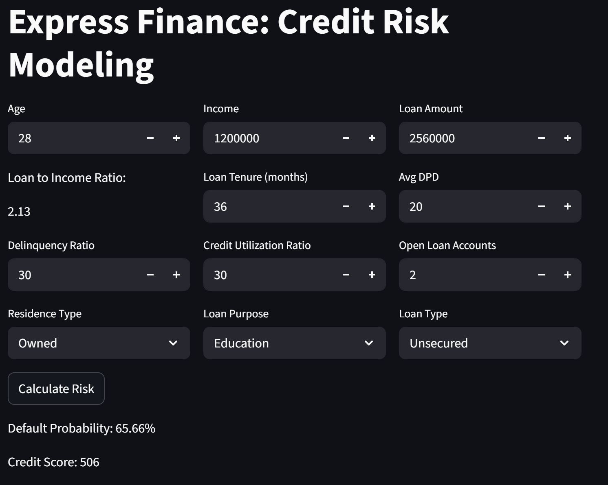

# 🚀 Project Title & Tagline
**Express Finance: Credit Risk Modelling**  
📊 *"Empowering Financial Institutions with Data-Driven Insights"*

Express Finance is a Python-based project that utilizes machine learning to predict credit risk for financial institutions. This project aims to provide a comprehensive framework for modeling and analyzing credit risk, enabling organizations to make informed decisions and optimize their lending strategies.

---

## 📖 Description
The Express Finance project is designed to address the challenges faced by financial institutions in predicting credit risk. By leveraging machine learning algorithms and data analysis techniques, this project provides a robust and scalable solution for credit risk modeling. The project consists of two primary components: a web-based application built using Streamlit and a Python library for prediction and data processing.

The web-based application allows users to input relevant data and receive predictions on credit risk. The Python library, on the other hand, is responsible for processing the input data, making predictions, and storing the results. The project also includes a data preprocessing module that ensures the input data is clean, normalized, and ready for modeling.

---

## ✨ Features
1. **Web-Based Application**: A user-friendly interface built using Streamlit, allowing users to input data and receive predictions on credit risk.  
2. **Machine Learning Model**: A robust machine learning model trained on a large dataset, enabling accurate and reliable predictions.  
3. **Data Preprocessing**: A comprehensive data preprocessing module that ensures the input data is clean, normalized, and ready for modeling.  
4. **Model Training**: The ability to train the machine learning model on custom datasets, allowing for flexibility and adaptability.  
5. **Real-Time Predictions**: The ability to make predictions in real-time, enabling financial institutions to make informed decisions quickly.  
6. **Scalability**: The project is designed to be scalable, allowing it to handle large volumes of data and user traffic.  
7. **Customization**: The ability to customize the web-based application and machine learning model to suit specific business needs.  
8. **Integration**: The possibility to integrate the project with other systems and tools, enabling seamless data exchange and automation.  

---

## 📊 Model Performance
The credit risk model was trained and evaluated on the dataset using multiple algorithms. Below is a comparison of results:  

| Model                  | Accuracy | Best F1-score | Notes |
|-------------------------|----------|---------------|-------|
| Logistic Regression     | ~92%     | 0.76          | Baseline model |
| Random Forest           | ~96%     | 0.79          | Improved generalization |
| XGBoost                 | ~97%     | **0.946**     | Best performing model |

- **Best Model**: XGBoost  
- **Evaluation Metric**: F1-score (macro), chosen due to class imbalance.  
- **Additional Metrics**: AUC was also computed for ROC analysis.  

---

## 🧰 Tech Stack
| Category               | Technology/Tool |
|-------------------------|-----------------|
| Frontend               | Streamlit |
| Backend                | Python |
| Data Preprocessing     | Pandas, NumPy, Scikit-Learn, Statsmodels |
| Machine Learning       | Logistic Regression, Random Forest, XGBoost |
| Imbalanced Data Handling | imbalanced-learn (RandomUnderSampler, SMOTETomek) |
| Hyperparameter Tuning  | RandomizedSearchCV, Optuna |
| Visualization          | Matplotlib, Seaborn |
| Model Storage          | Joblib |
| Tools                  | Jupyter Notebook, GitHub |

---

## 📁 Project Structure
```
express-finance/
main.py
prediction_helper.py
artifacts/
model_data.joblib
data/
credit_risk_data.csv
preprocessing.py
models/
credit_risk_model.joblib
requirements.txt
README.md
```

---

## ⚙️ How to Run
1. **Install dependencies**:  
   ```bash
   pip install -r requirements.txt
   ```
2. **Set up environment**: Ensure you have Python 3.10 or later installed and set up your environment accordingly.  
3. **Build**:  
   ```bash
   streamlit run main.py
   ```
4. **Deploy**: Deploy the project to a cloud platform or a local server.  

---

## 🧪 Testing Instructions
1. **Run the application**:  
   ```bash
   python main.py
   ```
2. **Input data**: Input relevant data into the web-based application.  
3. **Make predictions**: Make predictions using the web-based application.  
4. **Verify results**: Verify the accuracy of the predictions using the provided API reference.  

---

## 📸 Screenshots
  
[Insert screenshots of the web-based application and API reference]  

---

## 📦 API Reference
[Details about the available API endpoints can be added here.]  

---

## 👤 Author
[Your Name]  

---

## 📝 License
This project is licensed under the MIT License.  
